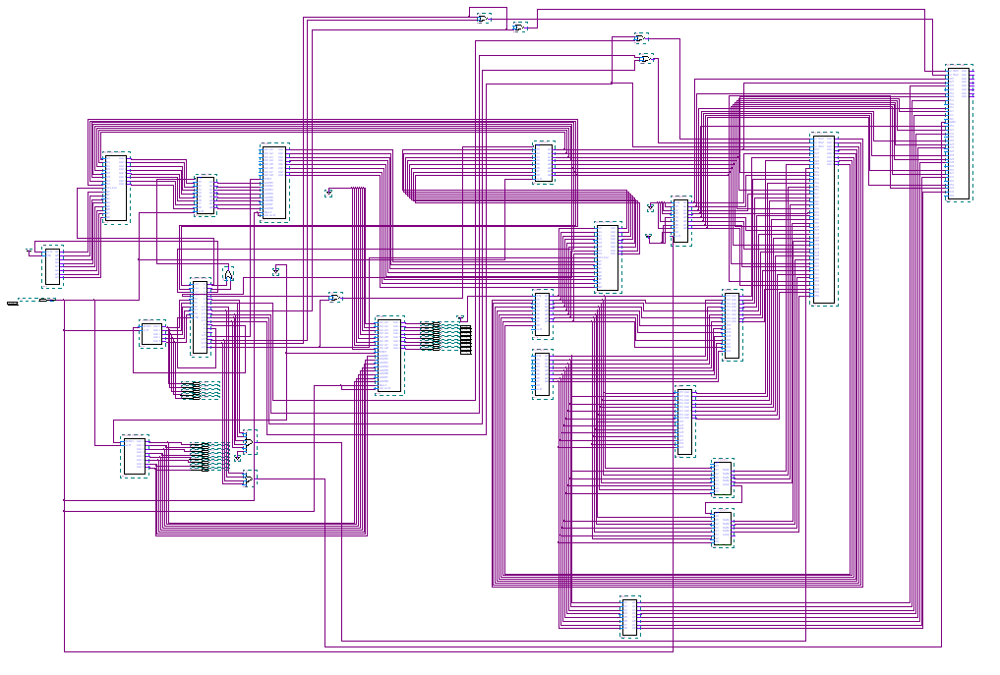

# Simple Computer

This is the design and implementation of a simple computer by using quartus II 9.0 and Cyclone II EP2C8T144C8. 

## Registers
|Symbol|Bits|Name|Function|
|---|---|---|---|
|MAR | 8 | Address Storage Register| Store address of intructions|
|MBR | 8 | Digits Storage Register | Store the digits of address in RAM|
|A | 8 | Register A | A register |
|B | 8 | Register B | B register |
|R | 8 | Register R | R register |
|PC | 8 | Program Counter | Store address |
|IR | 8 | Instructions Register | Store the intruction opcode|
|T | 8 | Timing Counter | Generate Timing Signals|

## General Overview

## Instructions
|Opcode|Mnemonic|QI|Function|
|---|---|---|---|
|0000 0000| LDA ADDR|q1|Put the content of address ADDR into A|
|0000 0001| STA ADDR|q2|Put A into the content of address ADDR|
|0000 0010| ADD A, B|q3|Add A and B, and then put into A|
|0000 0011| SUB A, B|q4|A substract B, and then put into A|
|0000 0100| ADD A, B|q5|Logic process A&&B, and then put into A|
|0000 0101| OR A, B|q6|Logic process AorB, and then put into A|
|0000 0110| MOV, A, R|q7|Put the content of R into A|
|0000 0111| MOC A, R|q8|Put the content of R into B|
|0000 1000| LDI A, OPRD|q9|Put the oprands into A|
|0000 1001| LDC B, OPRD|q10|Put the oprands into B|

# Test Repo
|Address|Content|Description|
|---|---|---|
0000 0000 | 0000 0110 | Put the content of R into A|
0000 0001 | 0000 1001 |  Put the oprands of the following address into B|
0000 0010 | 0000 1110 |  oprands -- 0000 1110|
0000 0011 | 0000 0010 |  add A and B, then put into A|
0000 0100 | 0000 0111 |  Put the content of R into B|
0000 0101 | 0000 1000 |  Put the oprands of the following address into A|
0000 0110 | 0011 1111 |  oprands -- 0011 1111|
0000 0111 | 0000 0011 |  A substract B and then put into A|
0000 1000 | 0000 1000 |  Put the oprands of the following address into A|
0000 1001 | 0000 1010 |  oprands -- 0000 1010|
0000 1010 | 0000 1001 |  Put hte oprands of the following address into B|
0000 1011 | 0000 0011 |  oprand -- 0000 0011|
0000 1100 | 0000 0100 |  logic process A&&B, and then put into A|
0000 1101 | 0000 1001 |  Put the oprand of the following addresss into B|
0000 1110 | 0000 0101 |  oprand -- 0000 1001|
0000 1111 | 0000 0101 |  logic process AorB, and then put into A|

Expected Results:
a). 00010101       
b). 00010001       
c). 00111111                 
d). 00101010                     
e). 00001010                
f). 00000010                
g). 00000111                

[More information and details can be seen at our report](./中级计算机的设计与实现.pdf)
